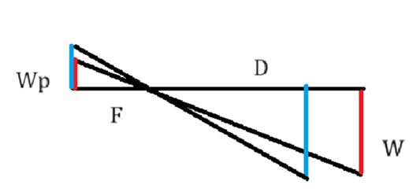
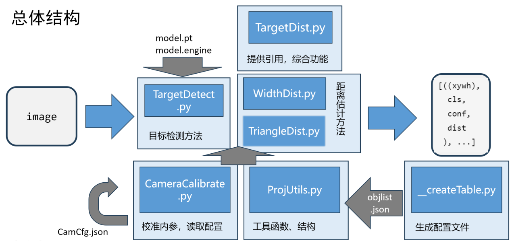

# TargetDist
24年春季学期进阶探究项目（课程）成果上传，主要由 YOLOv8 和 OpenCV 实现的由宽度进行的简单目标距离估计。

----
## 简单介绍
本项目尝试了两种方法实现视频画面中的目标检测和距离估计。

一种是根据几何相似方法实现的测距，


由几何关系得出 $\frac{W_p}{F}=\frac{W}{D}$
只需预先校准 $F=\frac{W_{p0}}{W_0}\times D_0$
则每次可根据 $D=\frac{W}{W_p}\times F$ 计算距离

另一种通过`cv2.recoverPose`获得坐标系中相机前后的位姿，将其作为基线转化为双目测距问题，估计点距离在计算目标距离，但目前还存在部分问题。

但项目的实际完成度并没有那么高，并没有很封装得很好（没有做package），只能同目录下`import`。项目管理方面也只是目前这样上传了一个结题时版本。

----
## 关于运行环境
本项目实测运行于 NCB00 载板上的 XavierNX 开发板环境上的 JetPack5.1.3。实测使用的是 Mode 10W Desktop。

`environment.yml` 和 `requirements.txt` 分别直接由环境下的 `conda` 和 `pip` 生成，可能不太全。但是其实主体部分处理好 Python3.8 下的 `YOLOv8` 和 `OpenCV` 的依赖即可运行，Windows上也能用。同样要在使用

----
## 运行实测
在各个代码中开头部分配置需要调整的参数后，直接运行 `TargetDist` 模块。
```bash
python3 TargetDist.py
```

或是直接在同目录下的文件中导入 `TargetDist`模块
```python
# example.pt
import cv2
import TargetDist
img = cv.imread('test.png')
ret = TargetDist.deal1frame(img)
```

----
## 各部分结构
`Main/` 下是主体代码


- `__createTable` 模块将原有的对象类别宽度信息规范保存到 json 文件中
- `ProjectUtils` 模块封装了一些用于屏幕显示的工具函数，对识别到对象类别先验信息的读取，以及未来用于优化的数据结构。
- `CameraCalibrate` 模块负责加载相机内参配置信息，如果读取失败则重新校准保存内参配置信息
- `TargetDetect` 模块负责对 YOLO 模型的加载和调用，以及对象的初步筛选
- `WidthDist` / `TriangleDist` 模块是两种距离估计方法的实现，读入图像和 YOLO 检测到的对象列表返回对象的距离
- `TargetDist` 模块提供了对项目总体功能的组装以供 import，同时实现了一份从文件或相机视频流输入读入图片结果并显示在屏幕上的 demo

`Accuracy/` 下是用于判断其精度的一次简单测试，测量了一个易拉罐上的苹果的距离

`Notes/` 下目前设想的是一些报告和介绍

